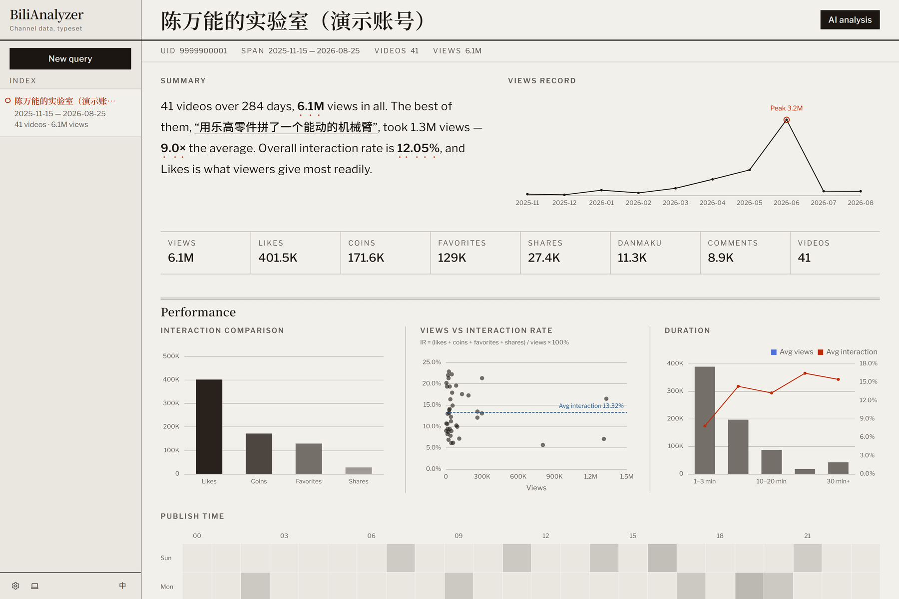

# BiliAnalyzer

一個用來解讀 Bilibili 創作者數據的儀表板：某段時間內發布了什麼、表現如何、觀眾怎麼說，以及 LLM 怎麼看待這三者。

<p>
  <a href="https://github.com/1morr/biliAnalyzer/actions/workflows/ci.yml"></a>
  <a href="LICENSE"></a>
</p>

[English](README.md) · **繁體中文**

給它一個 UID 和一段日期範圍，它就會抓出創作者在那段時間內發布的每一支影片，把表現數據畫成圖表，把標題、標籤、字幕、彈幕與留言斷詞成可以往下鑽的詞彙表，計算情緒分數，並把這一切拿去跟觀眾分群交叉比對。之後可以透過一個 OpenAI 相容端點，針對這些結果提問，模型會用工具呼叫存取同一份資料來回答。



## 快速開始

需要 Docker 和 Docker Compose。

```bash
git clone https://github.com/1morr/biliAnalyzer.git
cd biliAnalyzer
cp .env.example .env          # required — compose will not start without it
docker compose up --build -d
```

接著打開 **<http://localhost:8000>**。API 文件在同一個 port 底下的 `/docs`；建置好的前端也是同一個行程在提供服務，所以沒有另外的 web port。

### 立刻看到有資料的畫面

抓一個真實創作者的資料需要一段時間，而且必須有 `SESSDATA` cookie。想在沒有 cookie 的情況下讓每個面板都有像樣的資料，可以：

```bash
docker compose exec app python -m scripts.seed_demo
```

這會產生一個虛構創作者，附帶幾個月份的影片、留言與彈幕。加上 `--reset` 可以重新開始。

## 開始使用

1. **New query** —— 輸入創作者的 UID（就是 `space.bilibili.com/546195` 裡的那個數字），選一段日期範圍。側邊欄會顯示抓取進度。
2. **Dashboard** —— 摘要卡片、觀看數趨勢、互動數比較、觀看數對互動率散佈圖、時長分析、發布時段密度圖，還有可以點進去看底層彈幕與留言的詞彙表。觀眾分群（性別、會員等級、等級、地區）同時也可以當作篩選軸。
3. **Video detail** —— 單支影片的數據，附雷達圖，以及跟這次查詢平均值的差異。
4. **AI analysis** —— 在 Settings 裡設定 OpenAI 相容的 Base URL、key 與 model，接著就能追問問題，回答會用串流的方式回傳。

**抓取一定要 SESSDATA。** 每支影片都會經過的 `x/web-interface/view`，對沒有登入狀態的請求一律回 HTTP 412 —— 這是對線上 API 實測確認過的 —— 所以沒有 SESSDATA 的話，一開跑就直接失敗，不會只是功能少一半。要加上它：登入 bilibili.com，F12 → Application → Cookies → 複製 `SESSDATA`，貼到 Settings 裡。想先看看畫面，用上面的 demo seed。

## 安全性

這是一個**單人使用、沒有任何身分驗證的本機工具**。任何能連到這個 port 的人都能存取所有端點，所以 Compose 只把它綁定在 `127.0.0.1` 上。不要把這個 port 開放到你不能掌控的網路，也不要在沒有先加上身分驗證的情況下把它放到反向代理後面。

你的 SESSDATA 與 API key 在寫進 SQLite 之前，會先用 Fernet 加密，API 回傳時也會遮蔽顯示。加密金鑰放在 `DATA_DIR/.secret_key` —— 就在它所保護的資料庫旁邊，所以這只能防範單獨拿到 `.db` 檔案的情況，防不了對主機本身的存取。

## 技術棧

| Layer | |
|---|---|
| Frontend | Vite · React 19 · TypeScript · Tailwind CSS v4 · Base UI · ECharts |
| Backend | FastAPI · SQLAlchemy 2.0（async）· aiosqlite · httpx |
| 中文 NLP | jieba（斷詞）· SnowNLP（情緒分析） |
| AI | OpenAI SDK，透過 SSE 串流，支援 tool calling |
| 部署 | Docker Compose，單一 multi-stage image |

## 設定

| 變數 | 預設值 | |
|---|---|---|
| `DATABASE_URL` | `sqlite+aiosqlite:///./data/bilianalyzer.db` | 資料庫存放的位置 |
| `DATA_DIR` | `./data` | 存放資料庫與 `.secret_key` |
| `SECRET_KEY` | *(自動產生)* | Fernet 金鑰。第一次執行時產生並保存下來；如果想讓儲存的憑證能跨環境讀取，就明確設定這個值 |
| `CORS_ORIGINS` | `http://localhost:5173` | 只有前後端分離的開發模式才需要。留空就完全停用 CORS |

## 本機開發

```bash
# backend
cd backend && python -m venv .venv && .venv\Scripts\Activate.ps1
pip install -e ".[dev]"
uvicorn app.main:app --port 8000 --reload

# frontend, in another terminal
cd frontend && npm install && npm run dev      # http://localhost:5173
```

在 `backend/` 底下跑 `pytest`，在 `frontend/` 底下跑 `npm run build` 和 `npx eslint .`。需要 Python 3.11+ 與 Node 20+。

## 授權

[MIT](LICENSE)
